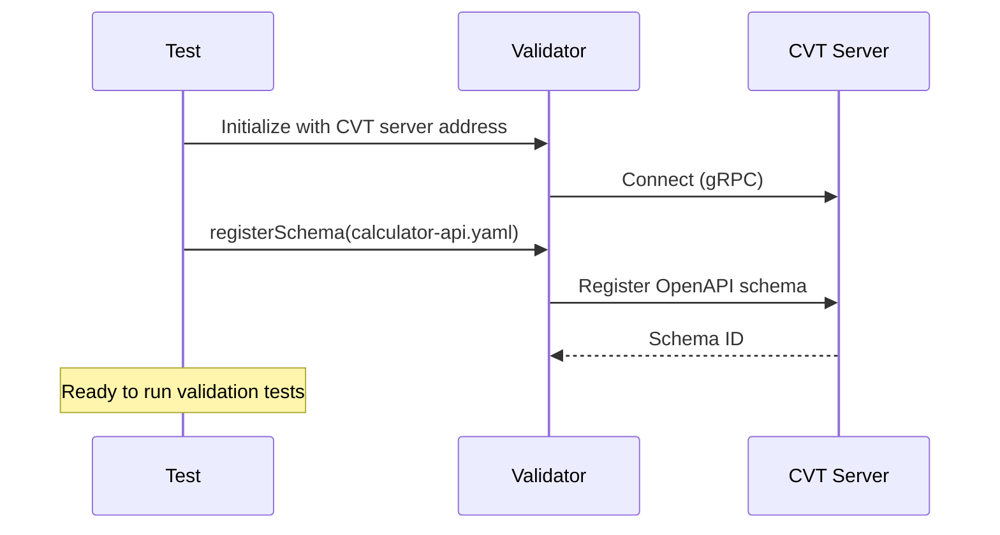
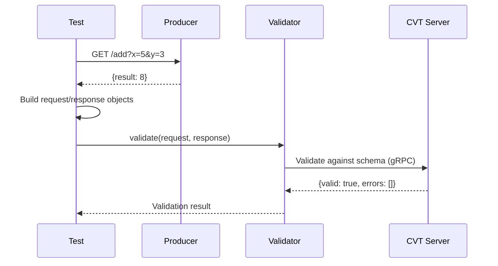
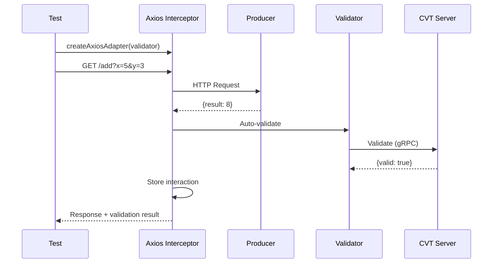
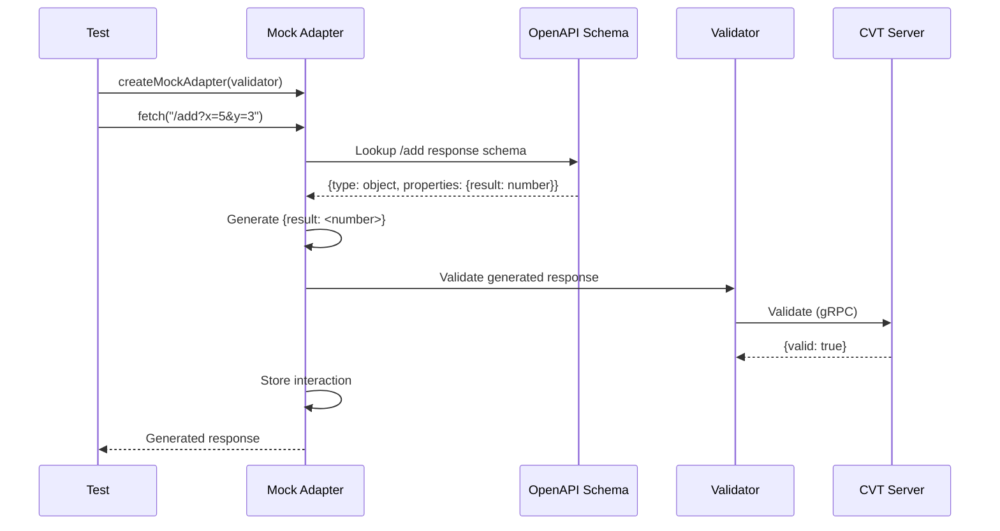
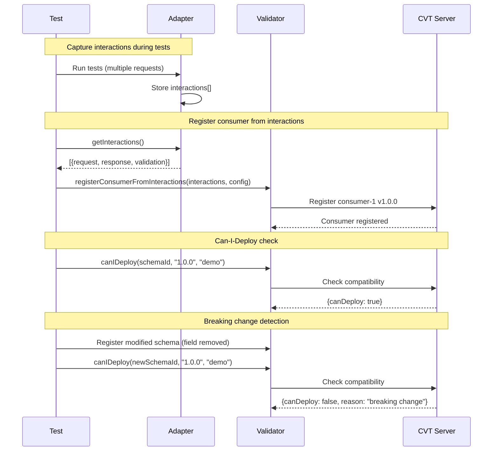

# Consumer-1 Contract Tests

This directory contains contract tests demonstrating all three CVT validation approaches for Consumer-1 (Node.js).

## Test Files

| File                   | Approach              | Requires Producer | Requires CVT | Recommended For                |
| ---------------------- | --------------------- | ----------------- | ------------ | ------------------------------ |
| `manual.test.js`       | Manual Validation     | Yes               | Yes          | Full control, custom scenarios |
| `adapter.test.js`      | HTTP Adapter          | Yes               | Yes          | Integration testing            |
| `mock.test.js`         | Mock Client           | No                | Yes          | Unit tests, CI/CD pipelines    |
| `registration.test.js` | Consumer Registration | No                | Yes          | Contract registration          |

## Prerequisites

1. Install dependencies:

   ```bash
   cd consumer-1
   npm install
   ```

2. Start services (for integration tests):

   ```bash
   make up
   ```

## Running Tests

### From consumer-1 directory

```bash
# Run all tests
npm test

# Run mock tests only (no producer needed)
npm run test:mock

# Run integration tests (requires producer)
npm run test:integration

# Run registration tests
npm run test:registration
```

### From project root

```bash
# Run all Consumer-1 tests
make test-consumer-1

# Run mock tests only
make test-consumer-1-mock

# Run integration tests
make test-consumer-1-integration

# Run registration tests
make test-consumer-1-registration
```

## Test Approaches Explained

### Test Setup

Before running tests, the schema is registered with CVT. This happens once at test initialization.



### 1. Manual Validation (`manual.test.js`)

Makes real HTTP calls to the producer, then explicitly validates the request/response pair against the contract. This approach gives full control over what gets validated and when.



```javascript
const result = await validator.validate(request, response);
expect(result.valid).toBe(true);
```

### 2. HTTP Adapter (`adapter.test.js`)

Automatic validation via axios interceptors. With `autoValidate: true` (the default), every HTTP request is validated transparently.



```javascript
const adapter = createAxiosAdapter({
  axios: client,
  validator,
  autoValidate: true,
});
await client.get("/add", { params: { x: 5, y: 3 } });
// Validation happens automatically
```

### 3. Mock Client (`mock.test.js`)

No real HTTP calls to the producer. Instead, responses are generated directly from the OpenAPI schema. This is ideal for unit testing in isolation or CI/CD pipelines where spinning up the producer isn't practical. The generated responses are schema-compliant (correct structure and types) but won't reflect real business logic. Interactions are still captured and can be used for consumer registration.



```javascript
const response = await mock.fetch("http://calculator-api/add?x=5&y=3");
// Response is generated from schema, no real HTTP call
```

### 4. Consumer Registration (`registration.test.js`)

Registers which endpoints and response fields this consumer depends on. This enables **can-i-deploy checks**: before deploying a new producer version, CVT verifies it won't break existing consumers. If a producer removes or changes a field that a registered consumer depends on, CVT flags it as a breaking change. Interactions captured during testing (via adapters) can be used to auto-generate the consumer registration.



```javascript
// Auto-registration
const consumer = await validator.registerConsumerFromInteractions(interactions, config);

// Manual registration
const consumer = await validator.registerConsumer({ usedEndpoints: [...] });
```

## Endpoints Tested

Consumer-1 uses these Calculator API endpoints:

- `GET /add?x={number}&y={number}` - Addition
- `GET /subtract?x={number}&y={number}` - Subtraction

## Environment Variables

| Variable          | Default                              | Description                           |
| ----------------- | ------------------------------------ | ------------------------------------- |
| `CVT_SERVER_ADDR` | `localhost:9550`                     | CVT server address                    |
| `PRODUCER_URL`    | `http://localhost:10001`             | Producer API URL                      |
| `SCHEMA_PATH`     | `../../producer/calculator-api.yaml` | Path to OpenAPI schema                |
| `CVT_ENVIRONMENT` | `demo`                               | Environment for consumer registration |
