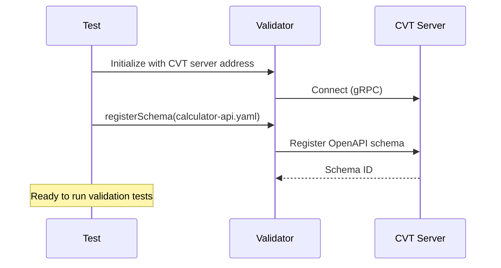
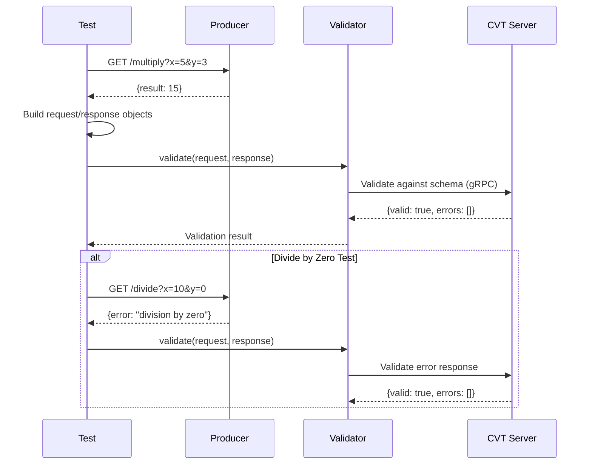
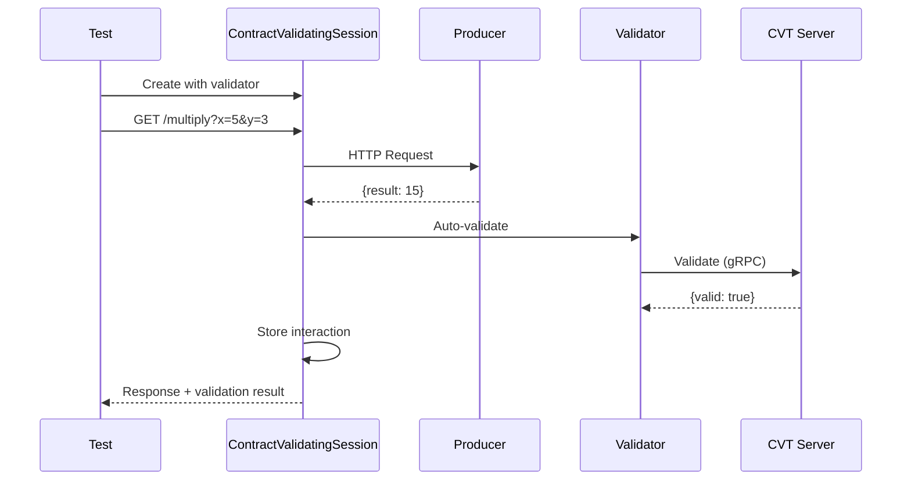
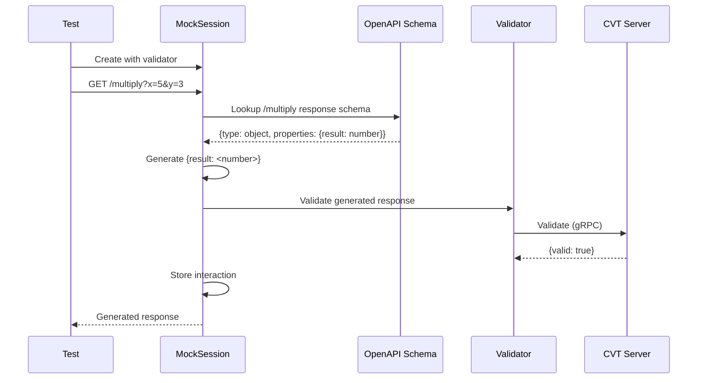
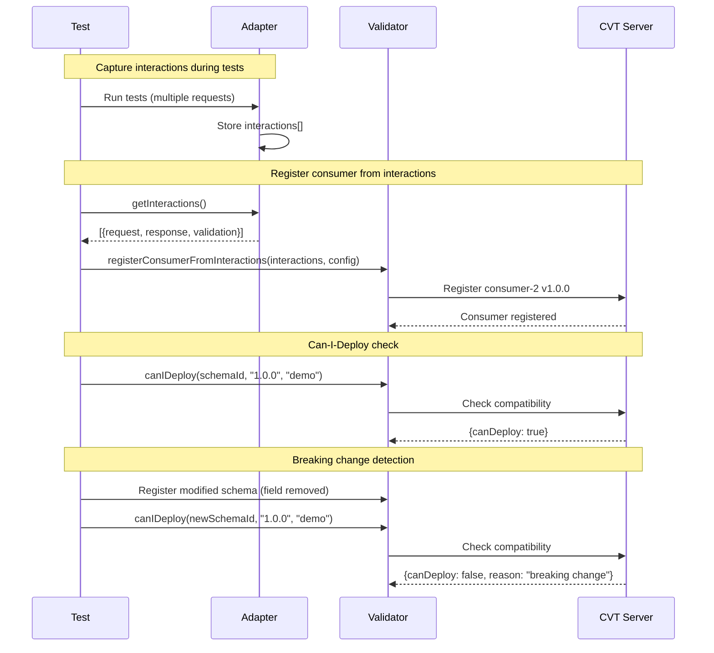

# Consumer-2 Contract Tests

This directory contains contract tests demonstrating all three CVT validation approaches for Consumer-2 (Python).

## Test Files

| File                   | Approach              | Requires Producer | Requires CVT | Recommended For                |
| ---------------------- | --------------------- | ----------------- | ------------ | ------------------------------ |
| `test_manual.py`       | Manual Validation     | Yes               | Yes          | Full control, custom scenarios |
| `test_adapter.py`      | HTTP Adapter          | Yes               | Yes          | Integration testing            |
| `test_mock.py`         | Mock Client           | No                | Yes          | Unit tests, CI/CD pipelines    |
| `test_registration.py` | Consumer Registration | No                | Yes          | Contract registration          |

## Prerequisites

1. Install dependencies:

   ```bash
   cd consumer-2
   uv sync --extra dev --extra cvt
   ```

2. Start services (for integration tests):

   ```bash
   make up
   ```

## Running Tests

### From consumer-2 directory

```bash
# Run all tests
uv run pytest tests/ -v

# Run mock tests only (no producer needed)
uv run pytest tests/test_mock.py -v

# Run integration tests (requires producer)
uv run pytest tests/test_adapter.py tests/test_manual.py -v

# Run registration tests
uv run pytest tests/test_registration.py -v
```

### From project root

```bash
# Run all Consumer-2 tests
make test-consumer-2

# Run mock tests only
make test-consumer-2-mock

# Run integration tests
make test-consumer-2-integration

# Run registration tests
make test-consumer-2-registration
```

## Test Approaches Explained

### Test Setup

Before running tests, the schema is registered with CVT. This happens once at test initialization via pytest fixtures.



### 1. Manual Validation (`test_manual.py`)

Makes real HTTP calls to the producer, then explicitly validates the request/response pair against the contract. This approach gives full control over what gets validated and when.



```python
result = validator.validate(request, response)
assert result["valid"] is True
```

### 2. HTTP Adapter (`test_adapter.py`)

Automatic validation via ContractValidatingSession. With `auto_validate=True` (the default), every HTTP request is validated transparently.



```python
session = ContractValidatingSession(validator, auto_validate=True)
response = session.get(f"{producer_url}/add", params={"x": 5, "y": 3})
# Validation happens automatically
```

### 3. Mock Client (`test_mock.py`)

No real HTTP calls to the producer. Instead, responses are generated directly from the OpenAPI schema. This is ideal for unit testing in isolation or CI/CD pipelines where spinning up the producer isn't practical. The generated responses are schema-compliant (correct structure and types) but won't reflect real business logic. Interactions are still captured and can be used for consumer registration.



```python
session = MockSession(validator, cache=True)
response = session.get("http://calculator-api/add", params={"x": 5, "y": 3})
# Response is generated from schema, no real HTTP call
```

### 4. Consumer Registration (`test_registration.py`)

Registers which endpoints and response fields this consumer depends on. This enables **can-i-deploy checks**: before deploying a new producer version, CVT verifies it won't break existing consumers. If a producer removes or changes a field that a registered consumer depends on, CVT flags it as a breaking change. Interactions captured during testing (via adapters) can be used to auto-generate the consumer registration.



```python
# Auto-registration
consumer = validator.register_consumer_from_interactions(interactions, config)

# Manual registration
consumer = validator.register_consumer(RegisterConsumerOptions(used_endpoints=[...]))
```

## Endpoints Tested

Consumer-2 uses these Calculator API endpoints:

- `GET /add?x={number}&y={number}` - Addition
- `GET /multiply?x={number}&y={number}` - Multiplication
- `GET /divide?x={number}&y={number}` - Division

## Environment Variables

| Variable          | Default                              | Description                           |
| ----------------- | ------------------------------------ | ------------------------------------- |
| `CVT_SERVER_ADDR` | `localhost:9550`                     | CVT server address                    |
| `PRODUCER_URL`    | `http://localhost:10001`             | Producer API URL                      |
| `SCHEMA_PATH`     | `../../producer/calculator-api.yaml` | Path to OpenAPI schema                |
| `CVT_ENVIRONMENT` | `demo`                               | Environment for consumer registration |

## Fixtures

The `conftest.py` file provides pytest fixtures for all tests:

- `validator` - Initialized ContractValidator with schema registered
- `cvt_server_addr` - CVT server address
- `producer_url` - Producer API URL
- `schema_path` - Path to OpenAPI schema
- `consumer_id` - Consumer identifier (`consumer-2`)
- `consumer_version` - Consumer version (`1.0.0`)
- `environment` - CVT environment (`demo`)
