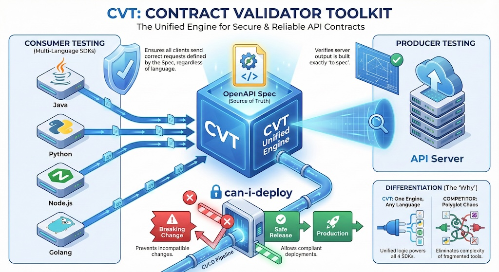
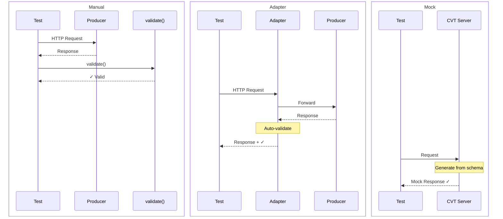
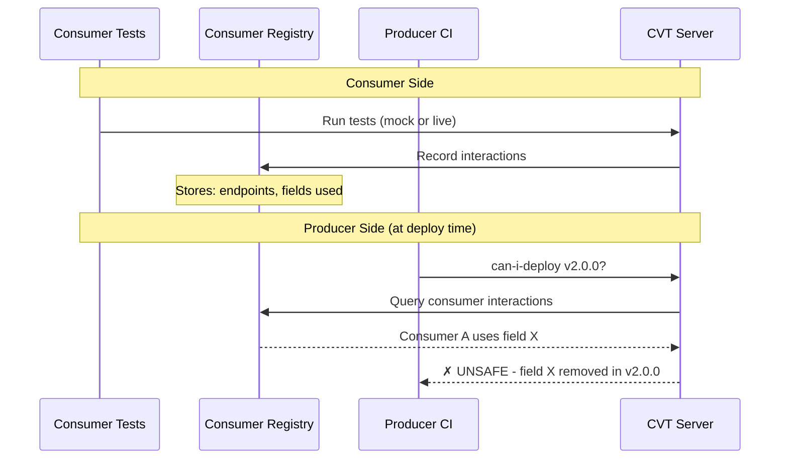
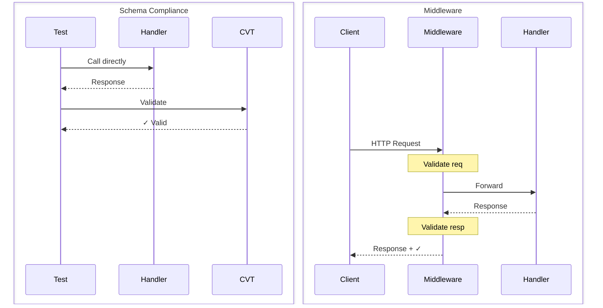
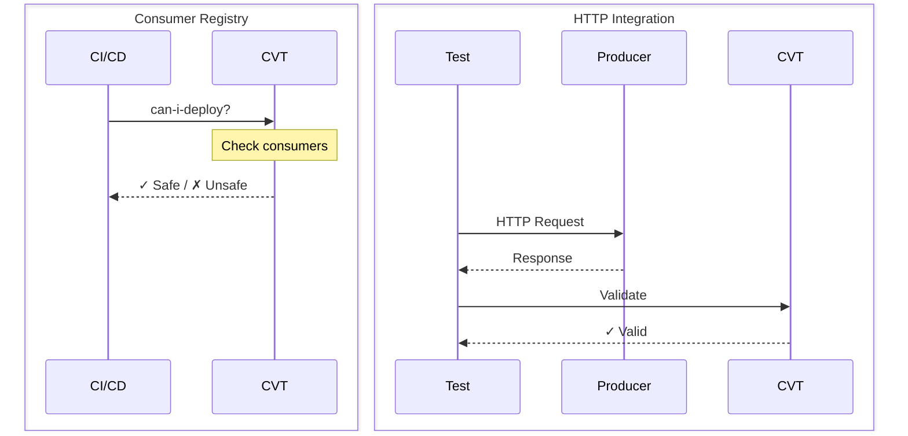
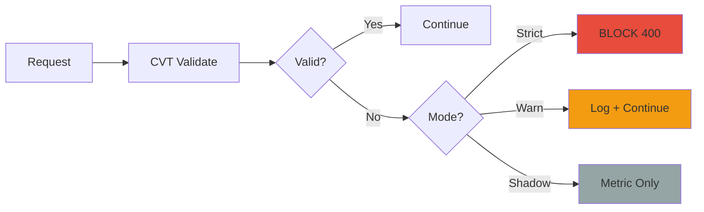
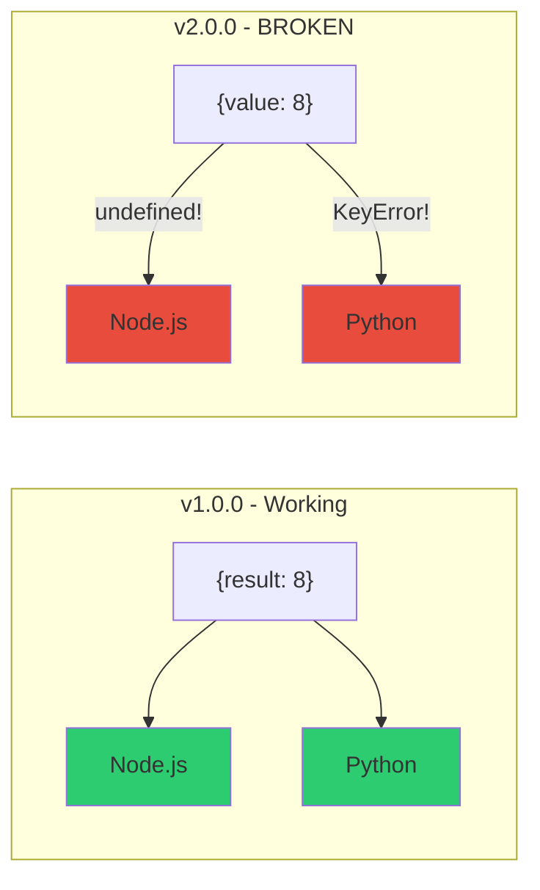
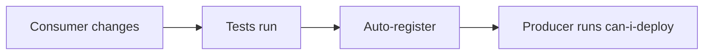
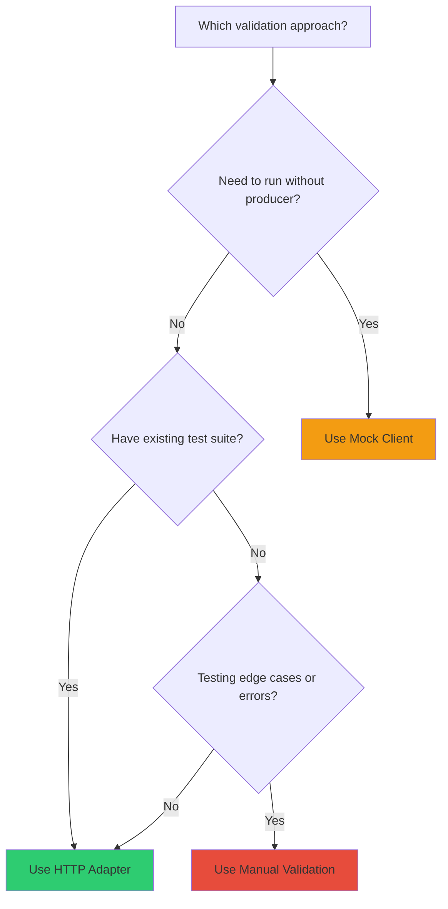

# Contract Validator Toolkit (CVT) - Presentation

---

# Title



**Let me show you how we can catch breaking API changes before they hit production.**

---

# Why CVT?

## The Problem

- **Producers don't know who consumes their APIs** — no visibility into dependencies
- **Breaking changes discovered in production** — after consumers are already broken
- **No single source of truth** — contracts drift from implementation

## The Solution

- **Consumer Registry** — tracks who uses what endpoints and fields
- **can-i-deploy** — blocks breaking changes before merge
- **OpenAPI as source of truth** — validate requests/responses against the spec

---

# Where CVT Fits - The Testing Pyramid

```text
                     /\
                    /  \
                   /    \
                  / E2E  \          Slow, expensive, flaky
                 /  Tests \
                /──────────\
               /            \
              /   CONTRACT   \     ◄── CVT: Fast, reliable
             /     TESTS      \
            /──────────────────\
           /                    \
          /    Integration       \
         /       Tests            \
        /──────────────────────────\
       /                            \
      /        Unit Tests            \  Fast, isolated
     /________________________________\
```

---

# CVT Architecture

```text
┌─────────────────────────────────────────────────────────────────────────────┐
│                           Contract Testing Overview                         │
├─────────────────────────────────────────────────────────────────────────────┤
│  CONSUMER TESTING                                                           │
│                                                                             │
│  Option A: Direct Testing          Option B: Auto-Validating Adapters       │
│  ┌─────────────────────────────┐   ┌─────────────────────────────┐          │
│  │                             │   │                             │          │
│  │  validator.validate(        │   │  HTTP Client (Axios/Fetch)  │          │
│  │    request, response        │   │         │                   │          │
│  │  )                          │   │   ┌─────▼─────┐             │          │
│  │                             │   │   │ CVT       │             │          │
│  │  Explicit validation in     │   │   │ Adapter   │             │          │
│  │  unit tests                 │   │   └───────────┘             │          │
│  │                             │   │                             │          │
│  │  "Test specific calls"      │   │  Auto-validates ALL calls   │          │
│  └─────────────────────────────┘   └─────────────────────────────┘          │
│                                                                             │
│  Option C: Mock Adapters (Offline Testing)                                  │
│  ┌──────────────────────────────────────────────────────────────────┐       │
│  │  Test without the real API:                                      │       │
│  │                                                                  │       │
│  │  const mock = createMockAdapter({ validator });                  │       │
│  │  const response = await mock.fetch('/users/123');                │       │
│  │                                                                  │       │
│  │  ✓ Generates schema-compliant responses    ✓ No network needed   │       │
│  │  ✓ Test before producer API exists         ✓ Fast, deterministic │       │
│  └──────────────────────────────────────────────────────────────────┘       │
│                                                                             │
├─────────────────────────────────────────────────────────────────────────────┤
│  PRODUCER TESTING                                                           │
│                                                                             │
│  Option A: Runtime Middleware          Option B: Test-Time Validation       │
│  ┌─────────────────────────────┐       ┌─────────────────────────────┐      │
│  │                             │       │                             │      │
│  │  ┌────────┐   ┌──────────┐  │       │  ┌────────┐   ┌──────────┐  │      │
│  │  │ Client │──►│ Your API │  │       │  │  Test  │──►│ Handler  │  │      │
│  │  └────────┘   └────┬─────┘  │       │  └────────┘   └────┬─────┘  │      │
│  │                    │        │       │                    │        │      │
│  │              ┌─────▼─────┐  │       │              ┌─────▼─────┐  │      │
│  │              │ CVT       │  │       │              │ CVT       │  │      │
│  │              │ Middleware│  │       │              │ TestKit   │  │      │
│  │              └───────────┘  │       │              └───────────┘  │      │
│  │                             │       │                             │      │
│  │  Validates live traffic     │       │  Validates handler output   │      │
│  │  "Reject bad requests"      │       │  "Does my code match spec?" │      │
│  └─────────────────────────────┘       └─────────────────────────────┘      │
│                                                                             │
│  Option C: Deployment Safety (can-i-deploy)                                 │
│  ┌──────────────────────────────────────────────────────────────────┐       │
│  │  Before deploying a new schema version, check consumer impact:   │       │
│  │                                                                  │       │
│  │  cvt can-i-deploy --schema my-api --version 2.0.0 --env prod     │       │
│  │                                                                  │       │
│  │  ✓ Query consumer registry    ✓ Detect breaking changes          │       │
│  │  ✓ Identify affected teams    ✓ Block unsafe deployments         │       │
│  └──────────────────────────────────────────────────────────────────┘       │
│                                                                             │
└─────────────────────────────────────────────────────────────────────────────┘
```

---

# Three Consumer Validation Approaches

**Purpose:** Validate that your requests match what the API expects, and that your code correctly handles the responses it returns.



| Approach         | Control | Producer | Best For           |
| ---------------- | ------- | -------- | ------------------ |
| **Manual**       | Full    | Yes      | Edge cases, errors |
| **HTTP Adapter** | Medium  | Yes      | Existing tests     |
| **Mock Client**  | Low     | **No**   | CI/CD, unit tests  |

**Manual** — You call `validate()` explicitly. Most code, but you control exactly what gets validated. Good for testing specific error responses or edge cases.

**HTTP Adapter** — Wraps your HTTP client (Axios, fetch, requests). Validation happens automatically on every call. Drop-in for existing test suites — minimal code changes.

**Mock Client** — No real HTTP calls. CVT generates responses from the schema. Fast, deterministic, no producer needed. You're testing against the schema, not the real API.

---

# Manual Validation

```javascript
// Manual: You control validation explicitly
const response = await client.get("/add", { params: { x: 5, y: 3 } });

const request = { method: "GET", path: "/add?x=5&y=3", headers: {} };
const validationResponse = {
  statusCode: response.status,
  body: response.data,
};

const result = await validator.validate(request, validationResponse);
expect(result.valid).toBe(true);
```

The nice thing here is you have full control — you decide exactly what gets validated.

---

# HTTP Adapter

```javascript
// Adapter: Validation happens automatically
adapter = createAxiosAdapter({
  axios: client,
  validator,
  autoValidate: true, // Magic happens here!
});

// Just make the request - validation happens automatically!
const response = await client.get("/add", { params: { x: 5, y: 3 } });
expect(response.data.result).toBe(8);

// Check validation results
const interactions = adapter.getInteractions();
expect(interactions[0].validationResult.valid).toBe(true);
```

The nice thing here is you don't touch your existing tests — validation just happens.

---

# Mock Client - The CI/CD Game-Changer

```javascript
// Mock: No HTTP calls at all!
mock = createMockAdapter({
  validator,
  cache: true,
  generateOptions: { useExamples: true },
});

// NO HTTP CALL - CVT generates response from schema!
const response = await mock.fetch("http://calculator-api/add?x=5&y=3");
const data = await response.json();

expect(response.status).toBe(200);
expect(data).toHaveProperty("result");
```

This is the interesting part — no producer needed. This is what makes CI/CD fast.

---

# Demo: Mock vs Live — The Difference

```bash
# Setup: Start services, then stop the producer
make up                           # Start CVT server + producer
make producer-down                # Stop just the producer

# Mock tests work — only need CVT server
make test-consumer-1-mock         # ✅ Works! CVT generates responses from schema

# Live tests fail — need the producer
make test-consumer-1-live         # ❌ Fails — producer not running

# Bring producer back up
make producer-up                  # Start just the producer

# Now live tests work
make test-consumer-1-live         # ✅ Works — real HTTP calls validated
```

**Mock** = needs CVT server only → fast CI, no full stack
**Live** = needs CVT server + producer → real HTTP validation

---

# Python Consumer - Same Concepts

Same three approaches, Pythonic API:

| Approach     | Python Class                | Notes                          |
| ------------ | --------------------------- | ------------------------------ |
| Manual       | `validator.validate()`      | Explicit validation            |
| HTTP Adapter | `ContractValidatingSession` | Drop-in for `requests.Session` |
| Mock Client  | `MockSession`               | No HTTP calls, same magic      |

```python
# Example: HTTP Adapter (one-liner change to existing code)
session = ContractValidatingSession(validator, auto_validate=True)
response = session.get(f"{producer_url}/add", params={"x": 5, "y": 3})
# That's it - validation happens automatically
```

The patterns are identical to Node.js — just the syntax changes.

---

# The Glue: Consumer Registry + can-i-deploy



**How it works:**

1. **Consumers register** — When consumer tests run, CVT records which endpoints and fields they use
2. **Registry stores dependencies** — "Consumer A uses GET /users, fields: id, name, email"
3. **Producers check before deploy** — `cvt can-i-deploy` queries the registry
4. **CVT detects conflicts** — If v2.0.0 removes `email`, and Consumer A uses it → UNSAFE

This is the safety net. Consumer validation ensures YOUR code is correct. Producer validation ensures YOU don't break others.

---

# Four Producer Validation Approaches

**Purpose:** Ensure your API implementation matches its contract and doesn't break consumers.





| Test Type         | Services       | Speed  | Purpose                           |
| ----------------- | -------------- | ------ | --------------------------------- |
| Schema Compliance | CVT only       | Fast   | Unit test handlers against schema |
| Middleware Modes  | CVT only       | Fast   | Test Strict/Warn/Shadow behavior  |
| Consumer Registry | CVT only       | Fast   | can-i-deploy checks               |
| HTTP Integration  | Producer + CVT | Medium | Full end-to-end validation        |

**Schema Compliance** — Test handlers directly without running a server. Call your handler function, capture the response, send it to CVT for validation. Fast feedback during development. Catches schema drift at unit test level. Downside: doesn't test the full HTTP stack.

**Middleware Modes** — CVT middleware intercepts every request and response, validating them against the schema in real-time. Three modes for different stages: Strict (block violations), Warn (log and continue), Shadow (metrics only). Good for gradual rollout. Start with Shadow in production, move to Strict over time.

**Consumer Registry** — Consumer tests record which endpoints and fields they use. When producers run `can-i-deploy`, CVT queries that registry to check if changes break anyone. This is the safety net before merge. Requires consumers to register first.

**HTTP Integration** — Make real HTTP calls to your running API, then validate responses against the schema. Slower, but tests the complete stack including routing and serialization. Use sparingly — the other approaches catch most issues faster.

---

# Schema Compliance Testing

```go
// producer/tests/compliance_test.go
func TestSchemaCompliance(t *testing.T) {
    testKit := NewProducerTestKit(t, config)
    calc := handlers.NewCalculator()

    req := httptest.NewRequest("GET", "/add?x=5&y=3", nil)
    rec := httptest.NewRecorder()

    calc.Add(rec, req)  // Call handler directly - no server!

    result, _ := testKit.ValidateResponse(ctx, producer.ValidateResponseParams{
        Method: "GET",
        Path:   "/add?x=5&y=3",
        Response: producer.TestResponseData{
            StatusCode: rec.Code,
            Body:       parseBody(rec.Body.Bytes()),
        },
    })

    if !result.Valid {
        t.Errorf("Schema violation: %v", result.Errors)
    }
}
```

Notice we're testing handlers directly — no HTTP server running. Fast feedback.

---

# Middleware Modes



```go
config := producer.Config{
    SchemaID:         "calculator-api",
    Mode:             producer.ModeStrict,  // or ModeWarn, ModeShadow
    ValidateRequest:  true,
    ValidateResponse: true,
}
```

| Mode       | Invalid Request | Invalid Response | Use Case               |
| ---------- | --------------- | ---------------- | ---------------------- |
| **Strict** | 400 Error       | 500 Error        | Production enforcement |
| **Warn**   | Log + Continue  | Log + Continue   | Gradual rollout        |
| **Shadow** | Metric only     | Metric only      | Testing in production  |

```bash
make test-producer-middleware
```

---

# Demo: Setup & Register Consumers

```bash
# Services should already be running from earlier demo
# If not: make up

# Register consumers — this records what they use
make test-consumer-1-registration   # Node.js: /add, /subtract
make test-consumer-2-registration   # Python: /add, /multiply, /divide
```

Now CVT knows: both consumers depend on the `result` field.

---

# The Breaking Change



**The change:** `result` → `value` seems innocent... but breaks ALL consumers!

```diff
-  version: 1.0.0        +  version: 2.0.0
-        result:         +        value:
```

---

# Demo: can-i-deploy

```bash
make demo-breaking-change
```

```text
RESULT: UNSAFE

Affected consumers:
  - consumer-1 (Node.js): Uses 'result' in /add, /subtract
  - consumer-2 (Python): Uses 'result' in /add, /multiply, /divide

RECOMMENDATION: Coordinate with affected consumers before deploying
```

This PR gets blocked before merge. Before anyone's Friday gets ruined.

---

# Three Important Gotchas

## 1. Schema Versioning

```yaml
info:
  version: 1.0.0 # Use semantic versioning
# Never overwrite existing versions - register new ones
```

## 2. Test Isolation

```bash
make test-unit        # Fast, isolated - run in CI
make test-integration # Full stack - run separately
```

## 3. Registration Timing



Register consumers **BEFORE** checking can-i-deploy!

---

# Which Approach Should I Use?



| Scenario                            | Recommended Approach |
| ----------------------------------- | -------------------- |
| CI/CD pipeline without services     | Mock Client          |
| Adding validation to existing tests | HTTP Adapter         |
| Testing specific error responses    | Manual Validation    |
| Unit testing consumer logic         | Mock Client          |
| Integration testing                 | HTTP Adapter         |

---

# Resources + Quick Start

## Documentation

- CVT Documentation: <https://sahina.github.io/cvt/>
- This Demo: <https://github.com/sahina/cvt-demo>

## Quick Start

```bash
# Clone the demo
git clone https://github.com/sahina/cvt-demo.git
cd cvt-demo

# Start services
make up

# Run all tests
make test
```

---

# Quick Recap

So what did we cover?

- **Schema validation** — catch contract drift early
- **Consumer registry** — know who's using your API
- **can-i-deploy** — block breaking changes before merge
- **Mock testing** — fast CI without spinning up services

That's the core of CVT.

---

# Next Steps

1. **Try the demo:** Clone, `make up`, `make test`
2. **Start small:** Pick ONE API to pilot CVT
3. **Discuss:** Share findings with your team

---

# Q&A

---

# Thank You

## Contract Validator Toolkit (CVT)

- <https://sahina.github.io/cvt/>
- <https://github.com/sahina/cvt-demo>
