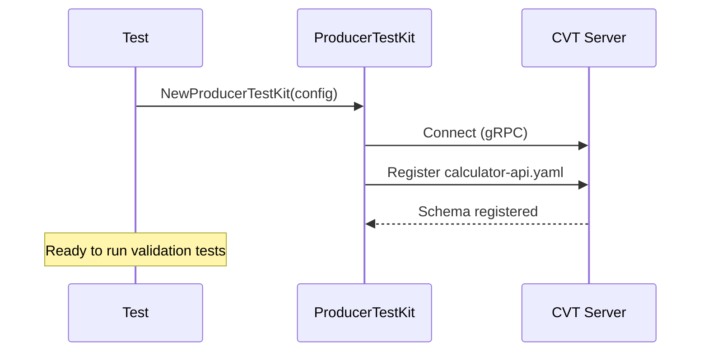
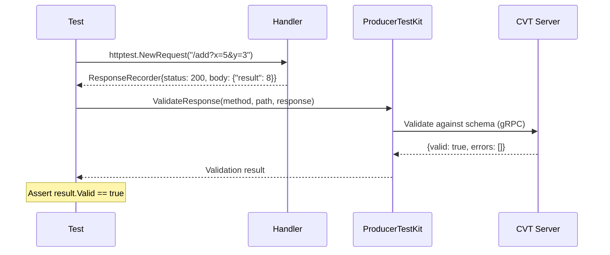
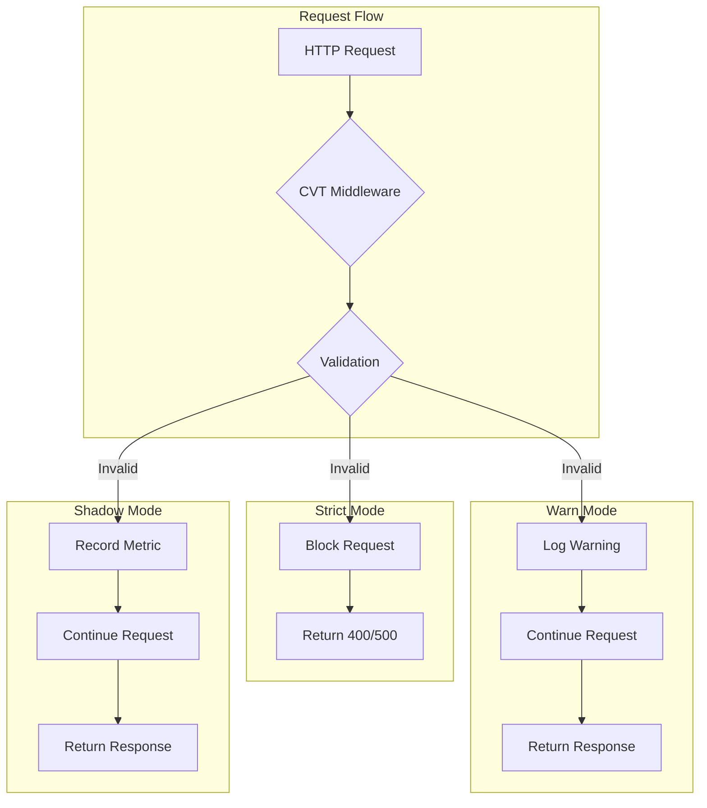
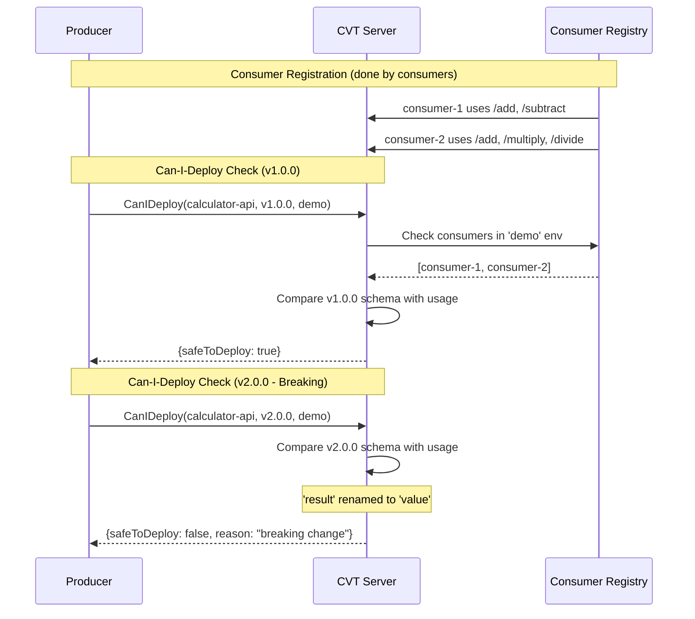
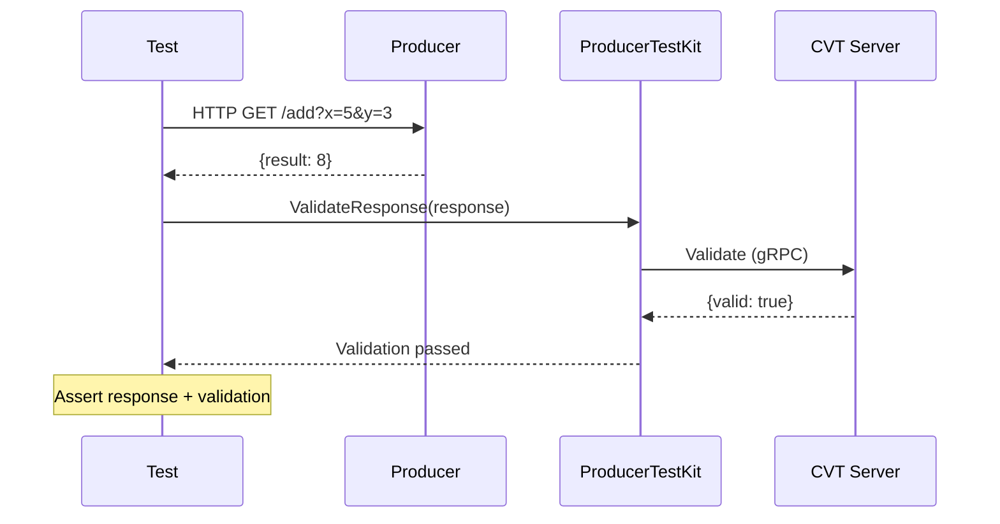
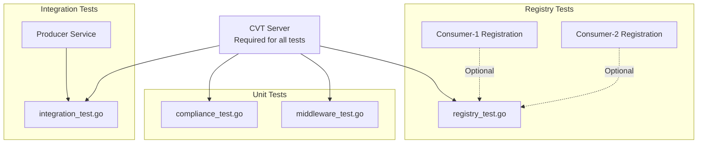

# Producer Contract Tests

This directory contains producer-side contract tests demonstrating three CVT validation approaches that mirror the consumer testing patterns.

## Test Files

| File                  | Approach          | Requires Producer | Requires CVT | Recommended For                  |
| --------------------- | ----------------- | ----------------- | ------------ | -------------------------------- |
| `compliance_test.go`  | Schema Compliance | No                | Yes          | Unit testing handler responses   |
| `middleware_test.go`  | Middleware Modes  | No                | Yes          | Testing Strict/Warn/Shadow modes |
| `registry_test.go`    | Consumer Registry | No                | Yes          | Can-i-deploy verification        |
| `integration_test.go` | HTTP Integration  | Yes               | Yes          | Full end-to-end testing          |

## Prerequisites

1. Start CVT server and producer:

   ```bash
   make up
   ```

2. (Optional) Register consumers for can-i-deploy tests:

   ```bash
   make test-consumer-1-registration
   make test-consumer-2-registration
   ```

## Running Tests

### From project root

```bash
# Run all producer tests
make test-producer

# Run specific test types
make test-producer-compliance    # Schema compliance tests
make test-producer-middleware    # Middleware mode tests
make test-producer-registry      # Consumer registry tests
make test-producer-integration   # HTTP integration tests
```

### From producer directory

```bash
cd producer

# Run all tests
go test ./tests/... -v

# Run specific test files
go test ./tests/... -run Compliance -v
go test ./tests/... -run Middleware -v
go test ./tests/... -run Registry -v
go test ./tests/... -run Integration -v
```

## Test Approaches Explained

### Test Setup

Before running tests, the schema is registered with CVT using the ProducerTestKit.



### 1. Schema Compliance Testing (`compliance_test.go`)

Tests that handler responses comply with the OpenAPI schema. Uses httptest to call handlers directly without a running server.



**Key tests:**

- `TestSchemaCompliance_AllOperations` - All calculator operations produce valid responses
- `TestSchemaCompliance_NegativeTests` - CVT catches schema violations (wrong field names, types)
- `TestSchemaCompliance_ErrorResponses` - Error responses (400) comply with error schema

### 2. Middleware Mode Testing (`middleware_test.go`)

Tests the three middleware modes (Strict, Warn, Shadow) and their behavior differences.



**Mode comparison:**

| Mode   | Invalid Request | Invalid Response | Use Case               |
| ------ | --------------- | ---------------- | ---------------------- |
| Strict | Block (400)     | Block (500)      | Production enforcement |
| Warn   | Log & continue  | Log & continue   | Gradual rollout        |
| Shadow | Metric only     | Metric only      | Canary testing         |

**Key tests:**

- `TestMiddleware_StrictMode` - Invalid requests are rejected
- `TestMiddleware_WarnMode` - Invalid requests are logged but continue
- `TestMiddleware_ShadowMode` - Validation runs but never blocks
- `TestMiddleware_ModeComparison` - Same requests through all modes

### 3. Consumer Registry Testing (`registry_test.go`)

Tests the can-i-deploy workflow to verify schema changes won't break registered consumers.



**Key tests:**

- `TestRegistry_CanIDeploy_CurrentSchema` - v1.0.0 should be safe to deploy
- `TestRegistry_CanIDeploy_BreakingSchema` - v2.0.0 (result→value) should be UNSAFE
- `TestRegistry_ListConsumers` - List registered consumers

### 4. HTTP Integration Testing (`integration_test.go`)

Full HTTP tests against the running producer service.



**Key tests:**

- `TestIntegration_AllEndpoints` - All endpoints return correct results
- `TestIntegration_WithCVTValidation` - Responses validated against schema
- `TestIntegration_ErrorResponses` - Error responses validated
- `TestIntegration_ConcurrentRequests` - Concurrent request handling

## Test Dependencies



## Breaking Change Detection

The v2.0.0 schema (`calculator-api-v2-breaking.yaml`) demonstrates breaking change detection:

| Version | Response Schema        | Status |
| ------- | ---------------------- | ------ |
| v1.0.0  | `{"result": <number>}` | Safe   |
| v2.0.0  | `{"value": <number>}`  | UNSAFE |

**Why v2.0.0 breaks consumers:**

- Consumer-1 expects `result` field for `/add` and `/subtract`
- Consumer-2 expects `result` field for `/add`, `/multiply`, and `/divide`
- Renaming `result` to `value` breaks all consumers

To see breaking change detection:

```bash
# First, register consumers
make test-consumer-1-registration
make test-consumer-2-registration

# Then run registry tests
make test-producer-registry
```

## Environment Variables

| Variable          | Default                  | Description                  |
| ----------------- | ------------------------ | ---------------------------- |
| `CVT_SERVER_ADDR` | `localhost:9550`         | CVT server gRPC address      |
| `PRODUCER_URL`    | `http://localhost:10001` | Producer HTTP URL            |
| `SCHEMA_PATH`     | `../calculator-api.yaml` | Path to OpenAPI schema       |
| `CVT_ENVIRONMENT` | `demo`                   | Environment for registration |
